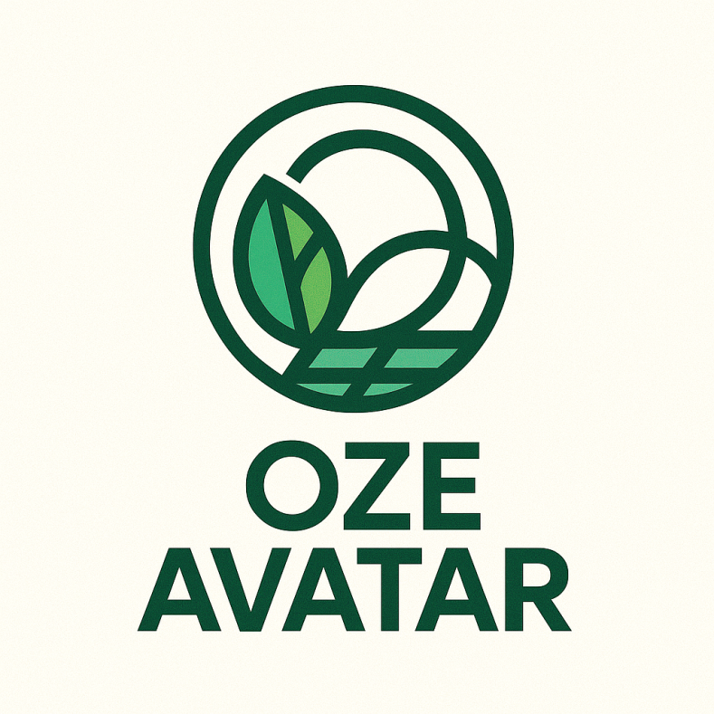
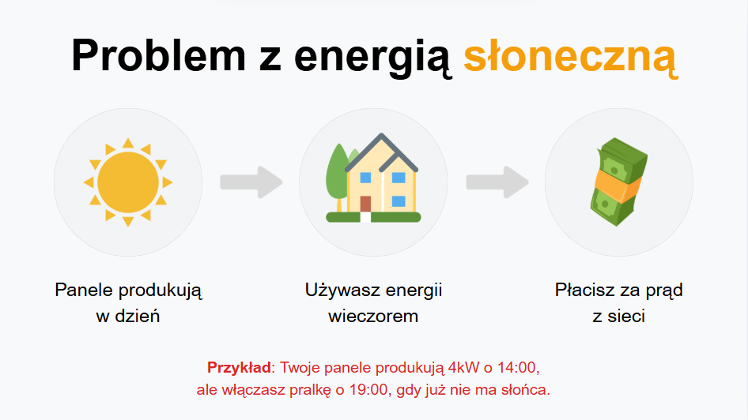
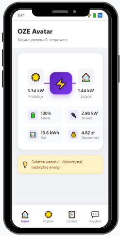
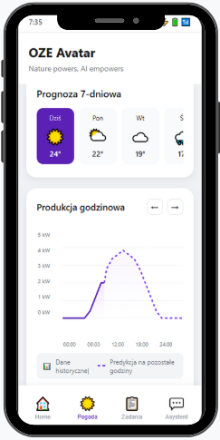
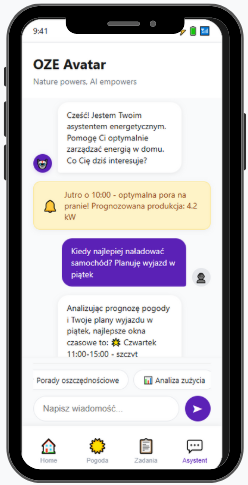
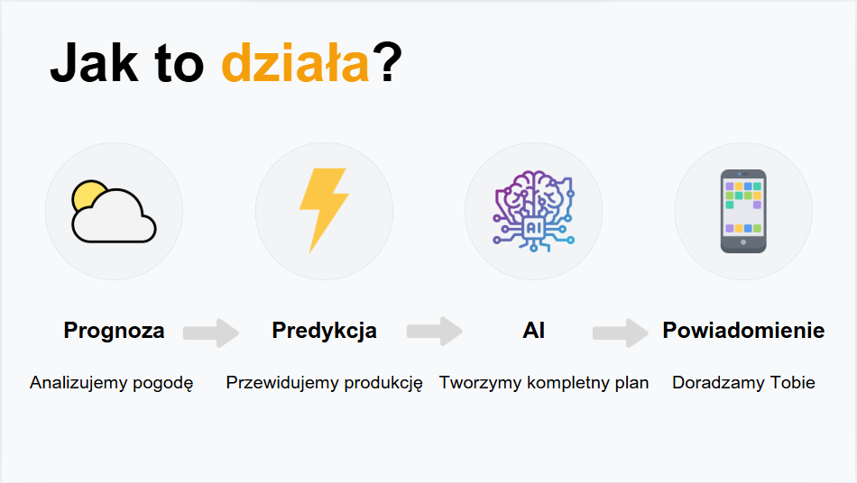
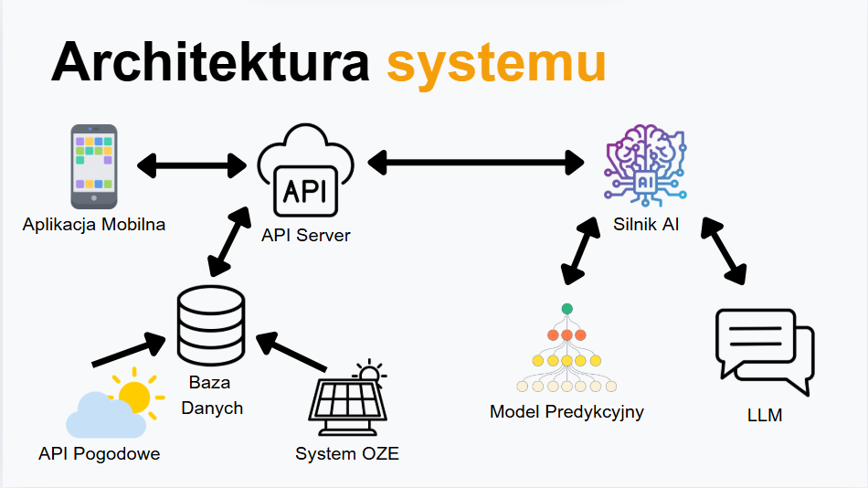

# CombAIns SpaceShield (OZE Avatar)

<div align="center">
  
  <h3>Natura daje energię. AI wie, jak ją wykorzystać.</h3>
</div>

## 🌞 O Projekcie

**OZE Avatar** to inteligentny asystent oparty na sztucznej inteligencji, który rewolucjonizuje sposób, w jaki gospodarstwa domowe korzystają z odnawialnych źródeł energii. Nasze rozwiązanie adresuje krytyczną lukę w zarządzaniu energią słoneczną, zapewniając zaawansowane prognozowanie i optymalizację zużycia energii.

Dzięki możliwości monitorowania 24/7, OZE Avatar pomaga użytkownikom osiągnąć nawet  **25% oszczędności** na rachunkach za energię przy zachowaniu **0% emisyjności**, tworząc bardziej zrównoważony i ekonomiczny domowy ekosystem energetyczny.

W przeciwieństwie do tradycyjnych rozwiązań, które jedynie pokazują bieżącą produkcję energii, nasz system wykorzystuje sztuczną inteligencję do przewidywania przyszłej dostępności energii, co pozwala na znacznie bardziej efektywne jej wykorzystanie.

### Problem, który rozwiązujemy

<div align="center">
  
</div>

Energia słoneczna ma fundamentalny problem niedopasowania czasowego:
- **Panele produkują energię w ciągu dnia**, gdy dostępne jest światło słoneczne
- **Większość gospodarstw domowych zużywa energię wieczorem**, gdy mieszkańcy wracają do domu
- **To prowadzi do płacenia za energię z sieci** mimo posiadania paneli słonecznych

Przykład: Twoje panele mogą generować 4kW o godzinie 14:00, ale włączasz pralkę o 19:00, gdy nie ma już słońca. To oznacza, że nie wykorzystujesz w pełni potencjału swojej instalacji fotowoltaicznej.

### Dlaczego jest to ważne?

Obecnie w Polsce:
- Ponad 1,5 miliona gospodarstw domowych posiada instalacje fotowoltaiczne
- Większość z nich nie ma możliwości optymalnego wykorzystania wytwarzanej energii
- Brak jest kompleksowych rozwiązań opartych o sztuczną inteligencję na płaszczyźnie gospodarstwa domowego

## ✨ Funkcjonalności

### Panel Główny

<div align="center">
  
</div>

- **Kluczowe dane** - przejrzysta wizualizacja przepływów energii
- **Inteligentne sugestie** - otrzymuj rekomendacje wspierane przez AI
- **Nowoczesny, czytelny design** - dostępny dla wszystkich użytkowników
- **Łatwa nawigacja** - przyjazny interfejs użytkownika
- **Pomiary w czasie rzeczywistym** - aktualne dane o produkcji i zużyciu
- **Wskaźniki bilansowania energii** - sprawdź ile energii oddajesz do sieci, a ile pobierasz

### Panel Pogoda i Prognoza Produkcji

<div align="center">
  
</div>

- **7-dniowa prognoza pogody** - planuj zużycie energii z wyprzedzeniem
- **Godzinowe przewidywania produkcji energii** - wiedz, kiedy wygenerujesz najwięcej mocy
- **Dane w czasie rzeczywistym** - aktualizowane co minutę
- **Porównanie z danymi historycznymi** - śledź wzorce i usprawnienia
- **Dokładna analiza nasłonecznienia** - przewidywania uwzględniające położenie słońca
- **Uwzględnienie lokalnych warunków atmosferycznych** - chmury, zamglenie, opady
- **Wizualizacja godzinowa** - precyzyjne planowanie pracy urządzeń domowych

### Panel Asystent AI

<div align="center">
  
</div>

- **Wsparcie modeli LLM** - integracja z zaawansowanymi modelami językowymi
- **Asystent energetyczny oparty na AI** - spersonalizowane rekomendacje
- **Szybkie podejmowanie decyzji** - natychmiastowe odpowiedzi na pytania związane z energią
- **Gotowe presety** - zoptymalizowane ustawienia dla typowych scenariuszy
- **Przyjazny interfejs mobilny** - zarządzaj energią w podróży
- **Proaktywne powiadomienia** - system sam zasugeruje optymalne momenty włączenia urządzeń
- **Integracja z kalendarzem** - asystent zaproponuje harmonogram pracy urządzeń w oparciu o Twoje plany
- **Analiza zachowań** - system uczy się Twoich nawyków i dostosowuje sugestie

### Panel Zarządzania Urządzeniami

<div align="center">
  
</div>

- **Harmonogramowanie pracy** - ustaw, kiedy urządzenia powinny działać
- **Inteligentne ładowanie pojazdów elektrycznych** - ładuj auto, gdy energia jest najtańsza
- **Automatyzacja procesów** - twórz zaawansowane scenariusze oszczędzania energii


## 💰 Dlaczego warto korzystać z OZE Avatar?

Korzystanie ze OZE Avatar może prowadzić do znacznych oszczędności:

| Urządzenie | Zużycie (kWh) | Koszt z OZE Avatar | Koszt bez OZE Avatar | Oszczędność |
|-----------|-------------|----------------------|--------------------------|---------|
| Pralka | 203 kWh | 167,48 zł | 223,30 zł | 55,82 zł |
| Zmywarka | 220 kWh | 181,50 zł | 242,00 zł | 60,50 zł |
| Samochód elektryczny | 2400 kWh | 1980,00 zł | 2640,00 zł | 660,00 zł |
| **Razem** | **2823 kWh** | **2328,98 zł** | **3105,30 zł** | **776,32 zł** |

**Ponad 25% oszczędności na rachunku za prąd!**

### Dodatkowe korzyści

- **Redukcja śladu węglowego** - maksymalne wykorzystanie czystej energii
- **Ochrona środowiska** - mniejsze zużycie energii z paliw kopalnych
- **Zwiększenie żywotności urządzeń** - optymalne warunki pracy
- **Szybszy zwrot z inwestycji w panele fotowoltaiczne** - dzięki lepszemu wykorzystaniu energii
- **Większa niezależność energetyczna** - mniejsza zależność od dostawców energii
- **Stabilizacja sieci elektroenergetycznej** - zmniejszenie obciążenia w godzinach szczytu
- **Przygotowanie do przyszłych zmian w taryfach energetycznych** - gotowość na dynamiczne ceny energii

## 🔍 Jak to działa?

<div align="center">
  
</div>

1. **Prognoza** - Analizujemy wzorce pogodowe i warunki nasłonecznienia przy użyciu zaawansowanych algorytmów uczenia maszynowego i danych z wielu źródeł meteorologicznych
2. **Powiadomienie** - Doradzamy Ci optymalne czasy korzystania z urządzeń poprzez system powiadomień push i interfejs aplikacji
3. **AI** - Tworzymy spersonalizowane dzienne plany energetyczne, uwzględniające Twoje preferencje, harmonogram i priorytety
4. **Predykcja** - Przewidujemy produkcję energii z wysoką dokładnością, wykorzystując modele uczenia maszynowego, dane historyczne i aktualne warunki atmosferyczne

### Szczegóły techniczne

- **Zaawansowane modele predykcyjne** - wykorzystujemy modele uczenia maszynowego do prognozowania produkcji energii
- **Algorytmy optymalizacyjne** - system automatycznie znajduje najlepsze czasy dla uruchomienia urządzeń
- **Ciągłe uczenie się** - system staje się coraz dokładniejszy z czasem dzięki analizie danych historycznych
- **Adaptacja do warunków lokalnych** - uwzględniamy specyfikę Twojej lokalizacji i instalacji
- **Wielopoziomowa analiza danych** - łączymy dane pogodowe, energetyczne i behawioralne
- **Przetwarzanie w chmurze** - potężna infrastruktura obliczeniowa zapewnia szybkie i dokładne predykcje
- **Lokalna analiza danych** - część obliczeń wykonywana jest lokalnie dla zwiększenia prywatności i szybkości

## 🏗️ Architektura systemu

<div align="center">
  
</div>

Nasze rozwiązanie integruje:
- **Model Predykcyjny LLM** - zaawansowany model językowy do interakcji z użytkownikiem
- **Silnik AI i Serwer API** - rdzeń systemu odpowiedzialny za obliczenia i analizę danych
- **Aplikacja Mobilna** - intuicyjny interfejs użytkownika dostępny na urządzeniach mobilnych
- **Baza Danych** - bezpieczne przechowywanie danych użytkownika i historii produkcji energii
- **Integracja z API Pogodowymi** - pobieranie aktualnych i prognozowanych danych meteorologicznych
- **Połączenie z Systemem OZE** - bezpośrednia komunikacja z falownikami i systemami zarządzania energią


## 📈 Potencjał rynkowy

**Pierwsza tego typu aplikacja na polskim rynku!**

- **0** bezpośredniej konkurencji z podobnymi funkcjami AI
- **1,5M** potencjalnych użytkowników w Polsce
- **Rosnący rynek OZE** - coraz więcej gospodarstw domowych inwestuje w fotowoltaikę
- **Zmieniające się regulacje prawne** - sprzyjające prosumentom i magazynowaniu energii
- **Wzrost cen energii** - zwiększający opłacalność optymalizacji zużycia
- **Rozwój elektromobilności** - więcej samochodów elektrycznych wymaga inteligentnego ładowania
- **Transformacja energetyczna** - trend w kierunku decentralizacji produkcji energii

### Przewagi konkurencyjne

- **Unikalne algorytmy AI** - rozszerzone modele o unikalne lokalne dane
- **Kompleksowa integracja** - połączenie zarządzania energią, prognozowania i asystenta AI
- **Zorientowanie na użytkownika** - prosty interfejs skrywający zaawansowaną technologię
- **Ciągłe doskonalenie** - regularne aktualizacje i nowe funkcjonalności
- **Lokalna ekspertyza** - rozwiązanie dostosowane do specyfiki polskiego rynku energii

## 🚀 Plany rozwoju

### Krótkoterminowe (3-6 miesięcy)
- Rozszerzenie kompatybilności z dodatkowymi modelami falowników
- Dodanie integracji z inteligentnymi urządzeniami domowymi (IoT)
- Wprowadzenie zaawansowanych raportów i analiz
- Optymalizacja algorytmów predykcyjnych
- Rozbudowa bazy wiedzy i funkcji asystenta AI

### Średnioterminowe (6-12 miesięcy)
- Wdrożenie sterowania urządzeniami bezpośrednio z aplikacji
- Integracja z systemami magazynowania energii
- Rozszerzenie funkcjonalności o zarządzanie pomp ciepła
- Wprowadzenie funkcji społecznościowych i porównawczych
- Rozwój platformy dla instalatorów i dystrybutorów

### Długoterminowe (1-2 lata)
- Stworzenie rynku wymiany nadwyżek energii między użytkownikami
- Integracja z inteligentnymi sieciami elektroenergetycznymi
- Rozszerzenie na rynki zagraniczne
- Rozwój zaawansowanych funkcji optymalizacji dla firm i przemysłu
- Stworzenie kompleksowego ekosystemu zarządzania energią

## 👥 Nasz Zespół

<div align="center">
  
</div>

- **Filip Langiewicz** - Inżynier AI/ML

- **Mikołaj Rowicki** - Programista

- **Igor Rudolf** - Badacz

- **Michał Pytel** - Projektant UI/UX

- **Maciej Momot** - Specjalista ds. Wideo Produktowego

- **Jakub Półtorak** - Programista

### Doradcy i Partnerzy

- **Eksperci z branży energetycznej** - konsultacje merytoryczne
- **Instalatorzy fotowoltaiki** - wsparcie techniczne i wdrożeniowe
- **Uczelnie techniczne** - współpraca badawczo-rozwojowa
- **Producenci falowników i baterii** - integracje i kompatybilność
- **Stowarzyszenia branżowe** - wsparcie promocyjne i edukacyjne

## 🌱 Wpływ społeczny i środowiskowy

- **Redukcja emisji CO2** - szacowana na 500kg rocznie dla przeciętnego gospodarstwa domowego
- **Edukacja ekologiczna** - zwiększanie świadomości na temat energii odnawialnej
- **Wspieranie transformacji energetycznej** - przyspieszanie odejścia od paliw kopalnych
- **Demokratyzacja technologii** - udostępnianie zaawansowanych narzędzi zarządzania energią dla każdego
- **Wspieranie lokalnych społeczności energetycznych** - umożliwianie efektywnej współpracy prosumentów
- **Zmniejszanie obciążenia sieci** - przyczynianie się do stabilności systemu elektroenergetycznego
- **Promowanie zrównoważonego stylu życia** - zachęcanie do świadomego korzystania z energii

## 🚀 Wypróbuj!

Przetestuj OZE Avatar już dziś: [Demo Live](https://filiplangiewicz.github.io/OZE_Avatar)

Obejrzyj naszą prezentację: [Film na YouTube](https://www.youtube.com/watch?v=dQw4w9WgXcQ)

## 🔧 Instalacja

```bash
# Klonowanie repozytorium
git clone https://github.com/FilipLangiewicz/CombAIns_SpaceShield.git

# Przejście do katalogu projektu
cd CombAIns_SpaceShield

# Instalacja zależności
npm install

# Uruchomienie serwera deweloperskiego
npm start
```

## 📑 Dokumentacja

Pełna dokumentacja projektu dostępna jest w katalogu `/docs` oraz online:

- [Przewodnik użytkownika](docs/user-guide.md)
- [Dokumentacja techniczna](docs/technical-docs.md)
- [API Reference](docs/api-reference.md)
- [Przewodnik integracji](docs/integration-guide.md)
- [FAQ](docs/faq.md)
- [Rozwiązywanie problemów](docs/troubleshooting.md)

## 🤝 Współpraca

Chętnie nawiążemy współpracę z:
- Producentami falowników i systemów zarządzania energią
- Instalatorami fotowoltaiki
- Dostawcami rozwiązań IoT
- Ekspertami branżowymi i naukowcami
- Organizacjami promującymi zrównoważony rozwój

Jeśli jesteś zainteresowany współpracą, skontaktuj się z nami przez formularz na naszej stronie lub bezpośrednio przez GitHub.

## 📄 Licencja

Rozpowszechniane na licencji MIT. Zobacz plik `LICENSE`, aby uzyskać więcej informacji.

## 📞 Kontakt

Link do projektu: [https://github.com/FilipLangiewicz/CombAIns_SpaceShield](https://github.com/FilipLangiewicz/CombAIns_SpaceShield)


---

<div align="center">
  <p>Stworzone z ❤️ przez zespół CombAIns</p>
  <p>COMBAYNS 2025</p>
</div>
